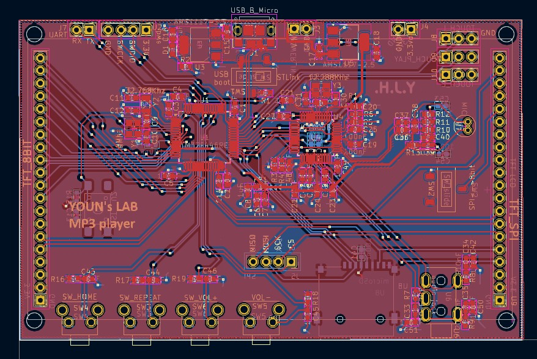
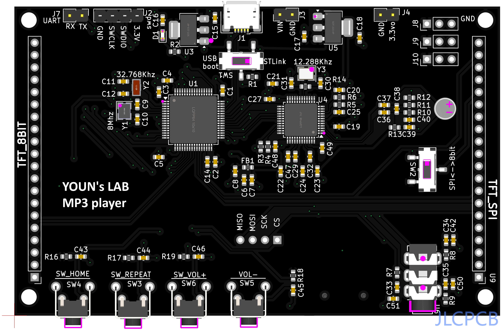
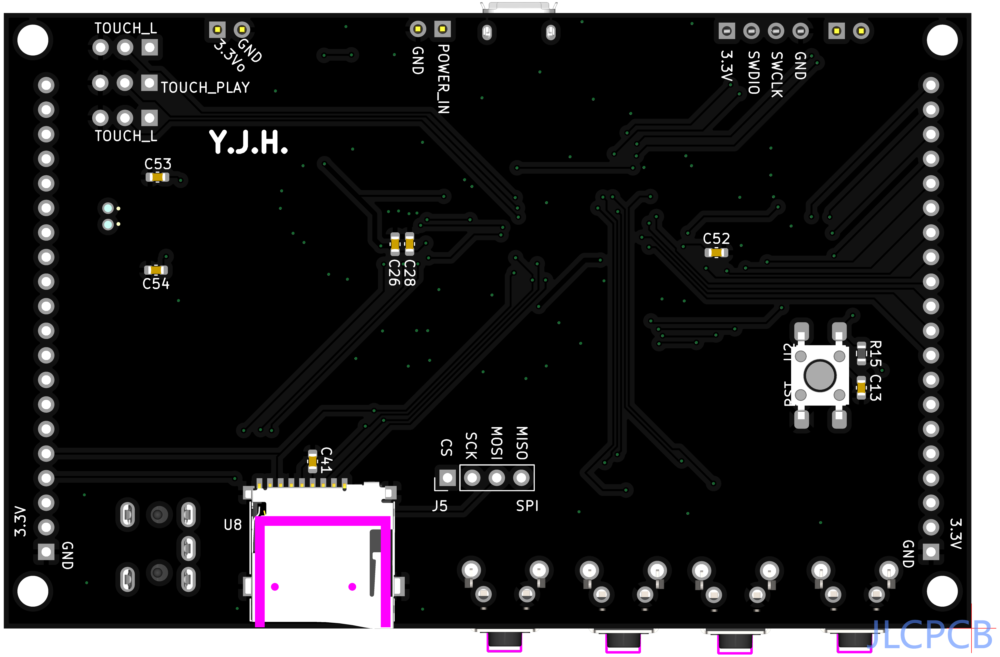

# MP3 Player Upgrade with STM32 and FreeRTOS

## Introduction
This project upgrades my previous MP3 player, originally built with an ATmega128, SD card module, and VS1003B module. For this enhanced version, I designed a custom PCB integrating all components and upgraded the CPU to an STM32F446RE for improved performance. Additionally, I implemented FreeRTOS to enable real-time functionality and better task management.

## Features
- Play MP3 files from an SD card.
- Real-time audio playback with FreeRTOS multitasking.
- Improved GUI design
- Folder-based playlist selection for organized playback.

## Hardware
- **STM32F446RE**: High-performance ARM Cortex-M4 CPU.
- **VS1003B**: MP3 decoder and audio output.
- **SD Card Module**: Storage for music files.
- **TFT LCD Module**: Display for GUI.
- **Custom PCB**: Compact and integrated design.

## Software
- **FreeRTOS**: Real-time task scheduling.
- **STM32 HAL**: Hardware abstraction layer.
- **FatFS**: File system for SD card access.

## Installation
1. Install STM32CubeIDE.
2. Connect the custom PCB board to an ST-Link via SWD. You can use ST-Link pin on Nucleo board.
3. Clone this repository and open the project in STM32CubeIDE.
4. build and flash the firmware using STM32CubeIDE.

## Usage
Place your MP3 files in folders within the root directory of the SD card.
Place resources in the root directory of the SD card.
Insert an SD card with MP3 files, power on the device, and enjoy your music!

## License
This project is licensed under the MIT License - see the [LICENSE](LICENSE) file for details.  
Includes FreeRTOS (MIT License) and STM32Cube libraries (BSD-3-Clause License).
